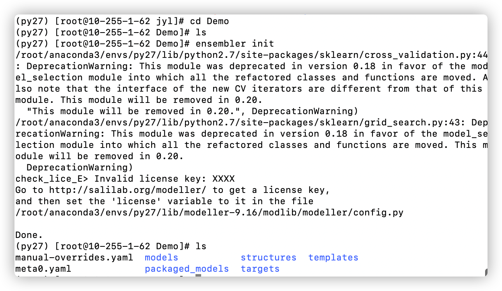
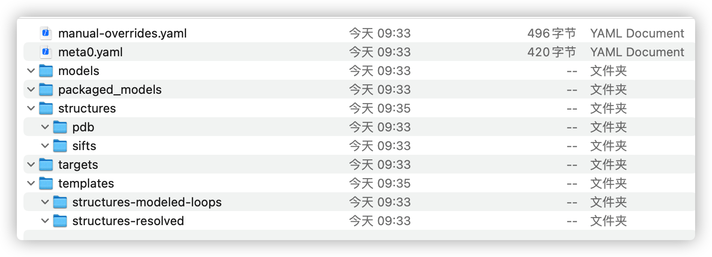
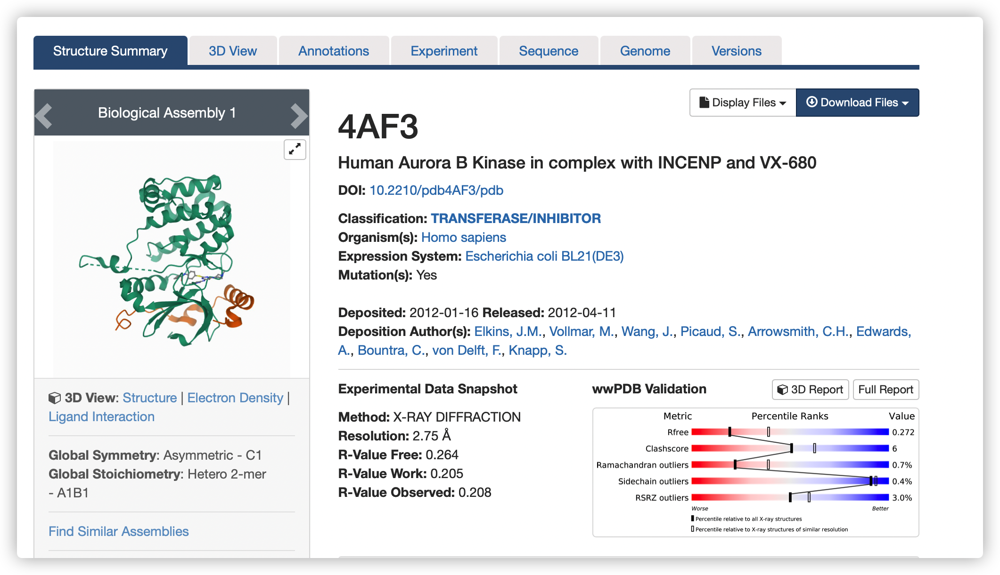
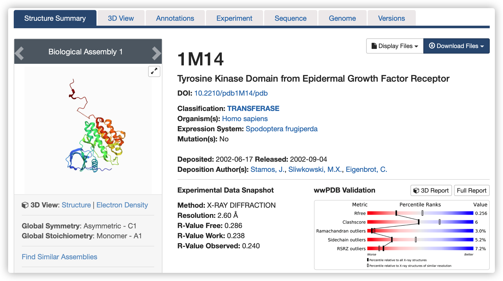

# Ensembler 使用笔记

## 环境搭建

GitHub项目：https://github.com/choderalab/ensembler

官方在线文档：https://ensembler.readthedocs.io/

推荐使用Conda进行安装即可，可以一次性安装相关依赖。

```
conda config --add channels omnia
conda config --add channels salilab
conda install ensembler
```

这里需要用到py2.7版本才可以，不然提示安装失败。

Conda安装与使用：https://www.jianshu.com/p/edaa744ea47d

更新：`conda update --all`

比如我的新环境叫py27，非默认

`conda create -n py27 python=2.7`

那么使用前需要注意切换环境：`conda activate py27`

 使用前有个小问题，需要降级sklearn版本到1.8

`conda install scikit-learn=0.18.0`

激活 anaconda 环境

 `source activate`

退出 anaconda 环境

 `source deactivate`

## 示例流程

`ensembler init`

在当前目录（Demo）下初始化一个新的项目，如下：



初始化后的这些文件夹都是空的，后面逐一探究存放内容。



```
ensembler quickmodel --target_uniprot_entry_name EGFR_HUMAN --uniprot_domain_regex '^Protein kinase' --template_pdbids 1M14,4AF3 --no-loopmodel
```

1M14,4AF3 都是Pdb 目前不知道为啥是用这两个






报错信息：

Exception: UniProt query returned empty string. Query string may have failed to match any UniProt entries, or may have been malformed.

解决:目前不知道怎么解决，网上没有参考方案。


check_lice_E> Invalid license key: XXXX

Go to http://salilab.org/modeller/ to get a license key,

and then set the 'license' variable to it in the file

/root/anaconda3/envs/py27/lib/modeller-9.16/modlib/modeller/config.py

说明：没有配置modeller的license key，这个可以按照提醒在官网获取并写入config.py即可。

